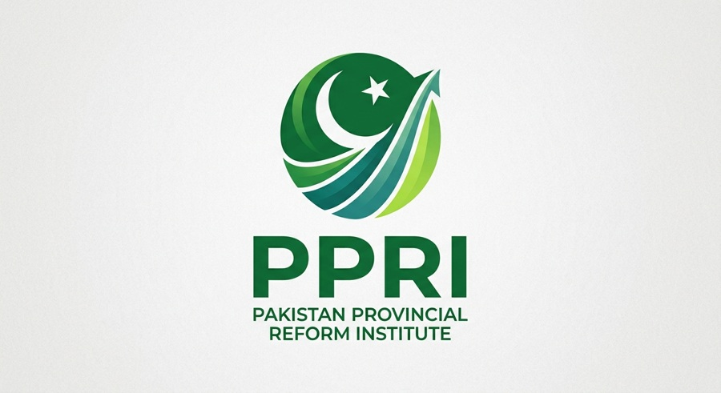
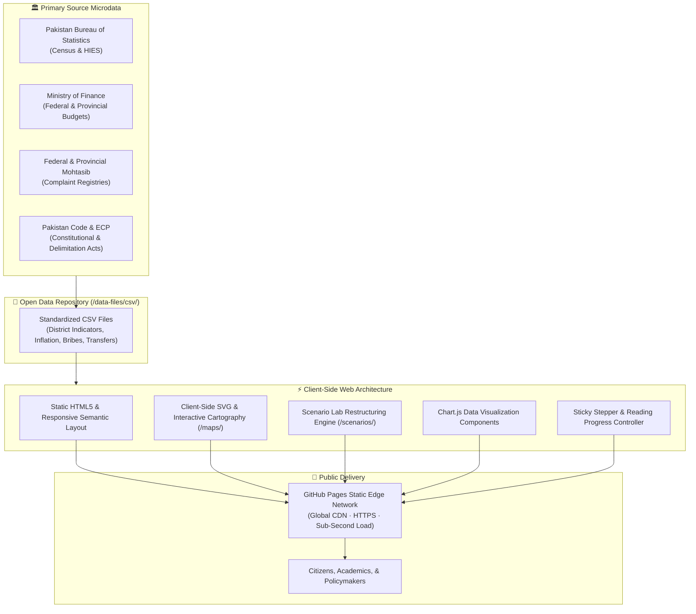

<div align="center">

  

  # Pakistan Provincial Reform Institute (PPRI)
  
  **Independent, Evidence-Based Public Policy Research & Subnational Governance Engineering**

  <p align="center">
    <a href="https://ppripakistan.github.io/"><strong>🌐 Explore Live Portal</strong></a> •
    <a href="https://ppripakistan.github.io/research/"><strong>📑 Research Hub</strong></a> •
    <a href="https://ppripakistan.github.io/data/centre.html"><strong>📊 Data Centre</strong></a> •
    <a href="https://ppripakistan.github.io/maps/"><strong>🗺️ Interactive Maps</strong></a> •
    <a href="https://ppripakistan.github.io/scenarios/"><strong>🧪 Scenario Lab</strong></a> •
    <a href="https://ppripakistan.github.io/consultation/"><strong>🗳️ Public Consultation</strong></a>
  </p>

  <p align="center">
    <a href="https://ppripakistan.github.io/"></a>
    <a href="https://creativecommons.org/licenses/by/4.0/"></a>
    <a href="#technical-architecture"></a>
    <a href="data-files/csv/"></a>
    <a href="https://www.pbs.gov.pk/census/"></a>
  </p>

</div>

---

## 🏛️ About the Institute

The **Pakistan Provincial Reform Institute (PPRI)** is an independent, non-partisan public interest policy research institute dedicated to addressing Pakistan's foundational structural challenges: **administrative scale, provincial governance over-centralization, spatial access inequality, and municipal fiscal devolution**.

Operating across federal, provincial, and local tiers of government, PPRI provides constitutional scholars, policymakers, economic analysts, and citizens with rigorous, data-driven frameworks to evaluate subnational restructuring proposals.

### Institutional Pillars
- **Scale & Representation**: Examining whether 4 provincial administrations are structurally capable of governing a federation of **241 million citizens**—one of the highest citizen-to-government ratios in the democratic world.
- **Fiscal Devolution (Article 140A)**: Analyzing how local councils and municipal governments have been systematically starved of operational budgets and constitutional authority following the 18th Constitutional Amendment.
- **Administrative Friction & Invisible Taxation**: Measuring citizen time, paperwork delays, discretionary extortion, and transaction costs incurred by ordinary households seeking basic public documentation.
- **Empirical District Equity**: Exposing district-level disparities in clean water access, childhood nutrition, court adjudication velocity, and primary education quality across Pakistan's 130+ districts.

---

## 📊 Quantitative Platform & Research Analytics

PPRI combines rigorous quantitative datasets from official census bulletins, provincial budgets, and household survey microdata into reproducible policy models:

| Metric Dimension | Scope & Scale | Primary Empirical Sources & Methodology |
|---|---|---|
| **Districts Analyzed** | **130+ Districts** across 4 Provinces & Territories | Pakistan Bureau of Statistics (PBS) 7th Population & Housing Census |
| **Flagship Research Reports** | **5 Comprehensive Reports** (120+ peer-reviewed chapters) | PPRI Public Interest Research Programme (2026) |
| **Analytical Treatises** | **20+ In-Depth Policy Inquiries** | Empirical investigations into Hazara, South Punjab, secondary cities, & scale |
| **Interactive Decision Engines** | **4 Client-Side Explorers** | Scenario Lab, Data Observatory, Interactive Map, Evidence Library |
| **Open Data Repositories** | **12 Clean CSV Datasets** | Public interest time-series, quintile breakdowns, and fiscal transfers |
| **Platform Delivery** | **Zero-Dependency Static Web** | 100% client-side HTML5/CSS3/ES6 execution, sub-second load, GitHub Pages |

---

## 🧭 Interactive Decision & Research Engines

PPRI builds accessible, client-side digital instruments that allow researchers and citizens to interact directly with administrative models:

```
┌─────────────────────────────────────────────────────────────────────────────────────────────────┐
│                                   PPRI DIGITAL RESEARCH ENGINES                                 │
├───────────────────────────────┬───────────────────────────────┬─────────────────────────────────┤
│  🗺️ Interactive Administrative│  🧪 Scenario Lab              │  📊 Data Centre & Observatory   │
│     Map & GIS Explorer        │     (Restructuring Simulator) │     (Multi-Dimensional Metrics) │
│                               │                               │                                 │
│  Explore 130+ districts,      │  Simulate new provincial      │  Analyze nutrition, water       │
│  division borders, travel     │  boundary proposals, NFC      │  access, education, and health  │
│  isochrones, and secretarial  │  fiscal transfers, and Senate │  indicators drawn directly      │
│  distance to capitals.        │  representation equity.       │  from official PBS microdata.   │
│                               │                               │                                 │
│  👉 [Launch Maps](/maps/)     │  👉 [Run Simulation](/scenarios/)│👉 [Explore Data](/data/centre.html)│
└───────────────────────────────┴───────────────────────────────┴─────────────────────────────────┘
```

1. **[Interactive Administrative Map](/maps/)**: Spatial mapping of Pakistan's current 4-province structure alongside proposed multi-province reorganization models. Computes geographic centroids and travel-time friction for peripheral districts.
2. **[Scenario Lab](/scenarios/)**: An interactive policy playground enabling users to adjust provincial boundary models, simulate fiscal allocations under alternative National Finance Commission (NFC) formulas, and test parliamentary seat distributions.
3. **[Data Centre & Observatory](/data/centre.html)**: Clean visual dashboards tracking multi-dimensional poverty, public expenditure composition (capital vs. salary overhead), and municipal service delivery benchmarks.
4. **[Legal & Constitutional Library](/research/legal-library.html)**: A catalog of relevant constitutional clauses (Articles 1, 239, 140A, 160), local government acts (2001, 2013, 2019, 2022), and historical boundary reform bills.

---

## 📑 The Public Interest Research Programme

PPRI's flagship 2026 research series investigates the lived reality of Pakistani citizens through five quantitative reports. Each paper is supported by open, machine-readable datasets:

<details>
<summary><strong>📄 Paper 001: Income Went Up, Why Does Life Feel Harder? (REP-01)</strong></summary>

<br>

- **Core Question**: Why do Pakistani households experience acute financial distress despite nominal income and minimum wage increases?
- **Key Findings**: Real purchasing power has deteriorated precipitously due to high-weight food and energy inflation outstripping nominal wage adjustments. Low- and middle-income quintiles expend up to 50% of household earnings purely on basic caloric survival.
- **Interactive Reading**: [Read Full Report](https://ppripakistan.github.io/research/reports/income-went-up-why-does-life-feel-harder.html)
- **Open Data**:
  - [`data-files/csv/inflation_income_illustration.csv`](data-files/csv/inflation_income_illustration.csv)
  - [`data-files/csv/hies_income_quintiles.csv`](data-files/csv/hies_income_quintiles.csv)

</details>

<details>
<summary><strong>📄 Paper 002: The Price of a Simple Task: Bureaucracy Cost (REP-02)</strong></summary>

<br>

- **Core Question**: What is the true economic price ordinary citizens pay to obtain routine government documentation (CNIC, domicile, land deed, birth certificate)?
- **Key Findings**: Beyond formal statutory fees, citizens incur massive "shadow taxes" including lost daily wages, travel costs, multiple round-trips due to discretionary rejections, and informal facilitation speed money. Analysis of over 6.6 million Citizen's Portal complaints reveals systemic redress bottlenecks.
- **Interactive Reading**: [Read Full Report](https://ppripakistan.github.io/research/reports/price-of-a-simple-task-pakistan-bureaucracy-cost.html)
- **Open Data**:
  - [`data-files/csv/citizen_portal_snapshot.csv`](data-files/csv/citizen_portal_snapshot.csv)
  - [`data-files/csv/mohtasib_2024.csv`](data-files/csv/mohtasib_2024.csv)

</details>

<details>
<summary><strong>📄 Paper 003: Same Country, Different Life: District-Level Disparities (REP-03)</strong></summary>

<br>

- **Core Question**: How drastically does a citizen's district of birth determine their access to fundamental constitutional guarantees?
- **Key Findings**: Pakistan's aggregate provincial indicators conceal vast intra-provincial chasms. While core metropolitan districts achieve >95% improved water access, peripheral districts in Balochistan and South Punjab suffer >30% moderate-to-severe food insecurity and severe basic infrastructure deficits.
- **Interactive Reading**: [Read Full Report](https://ppripakistan.github.io/research/reports/same-country-different-life-district-access.html)
- **Open Data**:
  - [`data-files/csv/water_access_by_province.csv`](data-files/csv/water_access_by_province.csv)
  - [`data-files/csv/food_insecurity_by_province.csv`](data-files/csv/food_insecurity_by_province.csv)

</details>

<details>
<summary><strong>📄 Paper 004: The Bribe You Can't See: Corruption as a Private Tax (REP-04)</strong></summary>

<br>

- **Core Question**: How does procedural friction and discretionary delay function as an involuntary, regressive tax on Pakistani households?
- **Key Findings**: Discretionary administrative checkpoints act as rent-extraction tolls. Lower-income citizens pay an exponentially higher percentage of their disposable income in bribes for urgent policing, land revenue, and municipal utilities compared to affluent demographics.
- **Interactive Reading**: [Read Full Report](https://ppripakistan.github.io/research/reports/bribe-you-cant-see-corruption-private-tax.html)
- **Open Data**:
  - [`data-files/csv/reported_bribe_amounts_ncps_2023.csv`](data-files/csv/reported_bribe_amounts_ncps_2023.csv)
  - [`data-files/csv/corruption_perception_2025.csv`](data-files/csv/corruption_perception_2025.csv)

</details>

<details>
<summary><strong>📄 Paper 005: Does Money Work Better When Spent Closer to the People? (REP-05)</strong></summary>

<br>

- **Core Question**: What does empirical evidence from Pakistan's own history and international federalism reveal about municipal spending efficiency?
- **Key Findings**: Local government expenditure share in Pakistan collapsed from ~10% under decentralized frameworks down to <4.5% under provincial centralism (compared to an OECD average of 40%). Provincial capital secretariats absorb the vast majority of developmental allocations while starving peripheral municipalities of basic capital works.
- **Interactive Reading**: [Read Full Report](https://ppripakistan.github.io/research/reports/does-money-work-better-spent-closer-to-people.html)
- **Open Data**:
  - [`data-files/csv/decentralization_benchmarks.csv`](data-files/csv/decentralization_benchmarks.csv)
  - [`data-files/csv/provincial_capital_spending_gap.csv`](data-files/csv/provincial_capital_spending_gap.csv)

</details>

---

## 🔬 Connected Analytical Treatises

In addition to the 5 flagship reports, PPRI publishes peer-reviewed policy inquiries addressing specific regional and constitutional questions:

- [**Four Provinces for 241 Million People**](https://ppripakistan.github.io/articles/four-provinces-241-million-people-administrative-scale.html) — Analyzing the structural arithmetic of Pakistan's governance scale deficit.
- [**South Punjab: Why Does the Demand Keep Returning?**](https://ppripakistan.github.io/articles/south-punjab-why-does-the-province-demand-keep-returning.html) — Historical neglect, secretarial distance, and fiscal reallocation.
- [**Hazara Province: Decades of Administrative Grievance**](https://ppripakistan.github.io/articles/hazara-province-why-has-the-demand-survived.html) — Linguistic identity, geographical separation, and resource equity in KP.
- [**The 18th Amendment: Did Devolution Stop at the Provincial Capital?**](https://ppripakistan.github.io/articles/18th-amendment-did-devolution-stop-at-provincial-capital.html) — Federal decentralization vs. municipal disempowerment.
- [**Can Pakistan Grow Beyond Its Provincial Capitals?**](https://ppripakistan.github.io/articles/can-pakistan-grow-beyond-provincial-capitals-secondary-cities.html) — Secondary cities as engines of economic diversification.
- [**How Far Is Government? Administrative Distance Isochrones**](https://ppripakistan.github.io/articles/how-far-is-government-administrative-distance.html) — Travel time friction as a barrier to constitutional rights.

---

## 🛠️ Technical Architecture & Data Pipeline

PPRI's portal is engineered for speed, long-term archival resilience, zero-cost public hosting, and complete transparency. It operates with **zero runtime dependencies, zero proprietary databases, and zero server-side middleware**:



### Architectural Principles
- **100% Client-Side Execution**: Calculations, simulations, and map interactions run entirely within the user's browser.
- **Zero Framework Lock-in**: Authored in pure Vanilla HTML5, modern CSS3 with custom properties, and modular ES6 JavaScript.
- **Universal Accessibility**: Accessible on desktop and mobile browsers, lightweight touch controls, and high-contrast typography.
- **Permanent Open Citations**: Clean, canonical URLs formatted for stable scholarly referencing.

---

## 📂 Open Data & Reproducibility

PPRI adheres strictly to open science and data reproducibility principles. All quantitative charts on the platform are powered by machine-readable, comma-separated values stored in [`data-files/csv/`](data-files/csv/):

```text
data-files/csv/
├── citizen_portal_snapshot.csv          # Citizen portal grievance resolution benchmarks
├── corruption_perception_2025.csv       # Sectoral corruption perception survey data
├── decentralization_benchmarks.csv      # Local government public expenditure shares
├── food_insecurity_by_province.csv      # Provincial food insecurity incidence
├── hies_income_quintiles.csv            # Household income & expenditure quintile trends
├── inflation_income_illustration.csv    # Purchasing power decay vs nominal wage rates
├── mohtasib_2024.csv                    # Federal Ombudsman complaint volume & redress
├── provincial_capital_spending_gap.csv  # Capital city vs peripheral district spending multiples
├── reported_bribe_amounts_ncps_2023.csv # Average reported bribe sizes by department
└── water_access_by_province.csv         # District improved drinking-water percentages
```

To clone the repository and explore the raw data locally:
```bash
git clone https://github.com/ppripakistan/ppripakistan.github.io.git
cd ppripakistan.github.io
# No npm install or build step required. Open index.html in any modern browser!
```

---

## 📖 Academic Citation

If you use PPRI research reports, interactive simulations, or curated datasets in scholarly publications, policy briefs, or media reports, please cite us:

### APA Format
> Pakistan Provincial Reform Institute (PPRI). (2026). *Public Interest Research Programme: Governance Scale, Administrative Burden, and Fiscal Devolution in Pakistan*. Islamabad: PPRI. https://ppripakistan.github.io/

### BibTeX Format
```bibtex
@misc{ppri2026programme,
  author       = {{Pakistan Provincial Reform Institute}},
  title        = {PPRI Public Interest Research Programme: Governance Scale, Administrative Burden, and Fiscal Devolution in Pakistan},
  year         = {2026},
  publisher    = {GitHub},
  howpublished = {\url{https://ppripakistan.github.io/}},
  note         = {Independent Research Repository}
}
```

---

## 🤝 Institutional Contact & Community

- **Official Web Portal**: [https://ppripakistan.github.io/](https://ppripakistan.github.io/)
- **Public Consultation & Policy Feedback**: [Participate in Consultations](https://ppripakistan.github.io/consultation/)
- **Public Discussion & Updates on X**: [@PPRI_Pakistan](https://x.com/PPRI_Pakistan)
- **Content Licensing**: All research texts, methodologies, and datasets are licensed under [Creative Commons Attribution 4.0 International (CC BY 4.0)](https://creativecommons.org/licenses/by/4.0/).

<br>

<div align="center">
  <sub>© 2026 Pakistan Provincial Reform Institute. Built with public-interest dedication for an effective, accountable, and geographically equitable Pakistan.</sub>
</div>
